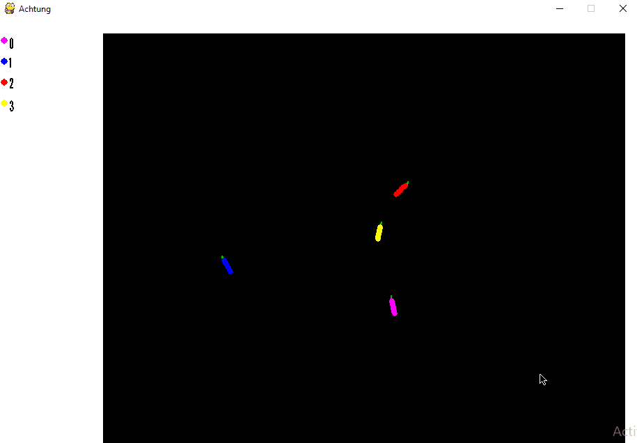

# Curve Fever / Achtung Die Curve!

Authors: Gunnar Noordbruis, Toine Hulshof, Rick van der Wal
Special thanks to: Aviad Sar-Shalom, Daniel Rotem, Gabrielle Marmur, Mira Finkelstien

Contents
--------

* [Description](#description)
* [Installation](#installation)
* [Usage](#usage)

Description
-----------

Curve Fever is a popular computer game for 2-4 players.

#### Game flow

"Each player spawns as a dot at a random spot on the playing field, move at a constant speed. Each player has the
ability to turn left or right, although the turning speed is limited such that sharp turns are not possible. As the dot
travels across the playing field, it draws a permanent, solid line in its wake, in the color of that player. When the
dot collides with any section of line or the boundary of the playing field, the player instantly loses, although the
line remains in the playing field until the end of the game. The game becomes increasingly difficult as more of the
playing field is blocked off by lines. Other players may try to draw barriers to block the path of other players,
forcing them into a collision. However, as the lines are being drawn, gaps are occasionally being generated that can be
used to escape a section of the map that has been blocked off. The game is won when all but one of the players has
collided." - Wikipedia

We wrote this project based on an open-source python implementation of Curve fever using the pygame library. The
original implementation can be found in this [repository](https://github.com/Valaraucoo/AchtungDiePython.git),
and the implementation that features a minimax and deep learning agent can be found
[here](https://github.com/dayMan33/CurveFever.git).

Installation
--------

#### Download

Clone this repository to your local machine with

    git clone https://github.com/Tortoaster/CurveFever.git

#### Set up

while in the project directory, run

    pip3 install -r requirements.txt

to install all dependencies. After that, you can train the NEAT player with

    python3 neat_threaded_main.py

Which will generate `.pickle` files in the `/static` folder.
These can be loaded in `/modules/players/neat_player.py` to use them.
By default, the program uses our latest successful agent.

Usage
-----

To play the game, run

    python3 main.py

Choose at least 2 players and start playing.
